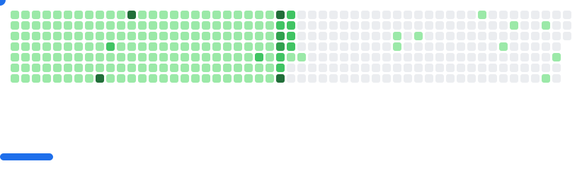

<h3 align="center">Crafting Digital Experiences 🚀</h3>

  🌱 Exploring the ever-evolving world of cloud technologies ☁ 
  👯 Open to new creative collaborations and exciting projects 
  🎯 2025 Mission: Ignite more stars in the Open Source galaxy 
  ⚡ Fun fact: I thrive in the adrenaline rush of online coding contests 
  💬 Got questions? Let's chat <a href="https://github.com/arnabnandy7/arnabnandy7/issues">here</a> 

 

<h3 align="center">Today's Weather</h3>

  
Calcutta, India - 21/08/2025

  
  
Moderate rain

 

<h3 align="center">😒 Tired of Saying No to someone?</h3>
<h5 align="center">Well, it's time to take a break from the same old "no's" and try something a little more... interesting! ✨</h5>

  I'm coming down with something; it's called laziness. 🛑❌ 

 

<h3 align="center">Let's Connect 🌐</h3>

  
  
  
  
  
  
  
  
  
  
  
  
  

 

<h3 align="center">Languages and Tools 🛠️</h3>

  
  
  
  
  
  
  
  
  
  
  
   
  
  
  
  
  
  
  
  
  
  
  
  
  
  

<picture>
  <source
    media="(prefers-color-scheme: dark)"
    srcset="images/breakout-dark.svg"
  />
  <source
    media="(prefers-color-scheme: light)"
    srcset="images/breakout-light.svg"
  />
  
</picture>

  

  
  
  
  
  

## GitAds Sponsored

