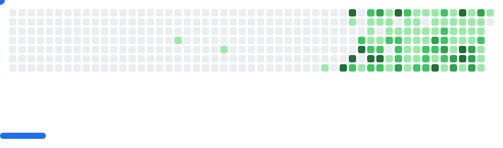

<h3 align="center">Crafting Digital Experiences 🚀</h3>

  🌱 Exploring the ever-evolving world of cloud technologies ☁️ 
  👯 Open to new creative collaborations and exciting projects 
  🎯 2026 Mission: Ignite more stars in the Open Source galaxy 
  ⚡ Fun fact: I thrive in the adrenaline rush of online coding contests 
  💬 Got questions? Let's chat <a href="https://github.com/arnabnandy7/arnabnandy7/issues">here</a> 

<h3 align="center">Open Source Quest summary</h3>

<table align="center">
  <tr><td align="center" valign="middle" width="33%"> <a href="https://github.com/prometheus/client_java">prometheus/client_java</a> (<strong>4</strong>)</td><td align="center" valign="middle" width="33%"> <a href="https://github.com/buntychakraborty/corona-app">buntychakraborty/corona-app</a> (<strong>3</strong>)</td><td align="center" valign="middle" width="33%"> <a href="https://github.com/Vault-Web/cloud-page">Vault-Web/cloud-page</a> (<strong>3</strong>)</td></tr>
  <tr><td align="center" valign="middle" width="33%"> <a href="https://github.com/Vault-Web/vault-web">Vault-Web/vault-web</a> (<strong>3</strong>)</td><td align="center" valign="middle" width="33%"> <a href="https://github.com/hardwood-hq/hardwood">hardwood-hq/hardwood</a> (<strong>2</strong>)</td><td align="center" valign="middle" width="33%"> <a href="https://github.com/JabRef/jabref">JabRef/jabref</a> (<strong>2</strong>)</td></tr>
  <tr><td align="center" valign="middle" width="33%"> <a href="https://github.com/jbangdev/jbang">jbangdev/jbang</a> (<strong>2</strong>)</td><td align="center" valign="middle" width="33%"> <a href="https://github.com/meks77/quarkus-axonframework-extension">meks77/quarkus-axonframework-extension</a> (<strong>2</strong>)</td><td align="center" valign="middle" width="33%"> <a href="https://github.com/Azure/azure-sdk-for-java">Azure/azure-sdk-for-java</a> (<strong>1</strong>)</td></tr>
</table>

[Explore the complete open source quest log](./docs/contributions.md)

<h3 align="center">Projects launched by me</h3>

| Project | What it does | Built with |
| :---: | :---: | :---: |
| [bugdna](https://github.com/arnabnandy7/bugdna) | Converts noisy Java stack traces into deterministic failure signatures. | Java |
| [svcguardian](https://github.com/arnabnandy7/svcguardian) | Detects Windows service configuration drift, restores services, and records an audit timeline. | PowerShell |
| [openissue.dev](https://github.com/arnabnandy7/openissue.dev) | Finds contributor-friendly GitHub issues by technology and label. | TypeScript |
| [api-response-comparator](https://github.com/arnabnandy7/api-response-comparator) | Compares API responses across environments to surface regression risks. | TypeScript |

<h3 align="center">Core Technical Stack</h3>

  Java · Spring · Quarkus · JavaScript · TypeScript · React · Node.js · PostgreSQL · Redis · Google Cloud · Linux · GitHub Actions

<h3 align="center">Today's Weather</h3>

Kolkata, India - 22/07/2026

   
  Patchy rain nearby (পার্শ্ববর্তী এলাকায় অনিয়মিত বৃষ্টিপাত)

🌙 <strong>Moon Phase:</strong> Waxing Gibbous (Rise: 12:38 PM, Set: 11:46 PM)   🌅 <strong>Sunrise:</strong> 05:04 AM | <strong>Sunset:</strong> 06:22 PM   💨 <strong>Wind:</strong> 21.2 kph | 💧 <strong>Humidity:</strong> 84% | 🌡️ <strong>Feels Like:</strong> 33.3 °C

<strong>AQI:</strong> Good <strong>PM2.5:</strong> 10.0 <strong>PM10:</strong> 10.1

  
<strong>Live dashboards and profile experiments</strong>

   

<h3 align="center">⏰ Hourly Forecast</h3>

| Time | Condition | Temp (°C) | Feels (°C) | Humidity (%) | Wind (kph) | Rain (%) |
| :---: | :---: | :---: | :---: | :---: | :---: | :---: |
| 2026-07-22 18:00 |  Patchy rain nearby | 26.5 | 27.1 | 87 | 15.5 | 35 |
| 2026-07-22 19:00 |  Patchy rain nearby | 26.4 | 26.3 | 88 | 11.9 | 32 |
| 2026-07-22 20:00 |  Light rain shower | 26.5 | 26.8 | 87 | 10.1 | 48 |
| 2026-07-22 21:00 |  Patchy rain nearby | 26.5 | 27.3 | 87 | 10.1 | 38 |
| 2026-07-22 22:00 |  Patchy rain nearby | 26.5 | 26.8 | 87 | 9.7 | 30 |
| 2026-07-22 23:00 |  Light rain shower | 26.3 | 26.0 | 88 | 7.9 | 60 |
| 2026-07-23 00:00 |  Light rain shower | 26.1 | 24.7 | 88 | 8.6 | 67 |
| 2026-07-23 01:00 |  Light rain shower | 26.1 | 24.9 | 87 | 9.0 | 60 |
| 2026-07-23 02:00 |  Light rain shower | 26.0 | 24.4 | 88 | 8.3 | 56 |
| 2026-07-23 03:00 |  Light rain shower | 26.0 | 24.3 | 87 | 7.9 | 37 |

<h3 align="center">⛓️ Cryptocurrency Prices</h3>

🪙 USDC: ₹99.08 | 📈 H: ₹99.08 | 📉 L: ₹96.71  💵 USDT: ₹99.99 | 📈 H: ₹100.5 | 📉 L: ₹98.5  ♦ ETH: ₹192999.4 | 📈 H: ₹193761.7 | 📉 L: ₹189999.0  ₿ BTC: ₹6596907.0 | 📈 H: ₹6654768.0 | 📉 L: ₹6497424.0  ⚡ BNB: ₹56230.53 | 📈 H: ₹57543.87 | 📉 L: ₹56230.53  

<h3 align="center">🔋 Fuel Prices</h3>

⛽ Petrol: ₹— ➖ 🛢️ Diesel: ₹— ➖

<h3 align="center">😒 Tired of Saying No to someone?</h3>
<h5 align="center">Well, it's time to take a break from the same old "no's" and try something a little more... interesting! ✨</h5>

  I just looked in the mirror and practiced saying 'no' and it felt right. 🛑❌ 

<h3 align="center">Let's Connect 🌐</h3>

  
  
  
  
  
  
  
  
  
  
  
  
  

  
<strong>GuestBook</strong>

   

<h3 align="center">Languages and Tools</h3>

  
  
  
  
  
  
  
  
  
  
  
   
  
  
  
  
  
  
  
  
  
  
  
  
  
  

<picture>
  <source
    media="(prefers-color-scheme: dark)"
    srcset="images/breakout-dark.svg"
  />
  <source
    media="(prefers-color-scheme: light)"
    srcset="images/breakout-light.svg"
  />
  
</picture>

  

  
  &nbsp;&nbsp;
  
  

  

  
  
  

  

  
  

  <!--  -->
  

  
  

  

  
  

<h2 align="center" id="badge-wall">🏅 Badge Wall</h2>

> 🔽 **Tip:** Select the dropdown below to view my full collection of Credly badges.

  
📜 Click here to expand and view my badges

   

  

  <!--START_SECTION:badges-->
  
  
  
  
  
  
  
  
  
  
  
  
  <!--END_SECTION:badges-->
  

  
<strong>Memes and sponsorship</strong>

   

  

  

## GitAds Sponsored

