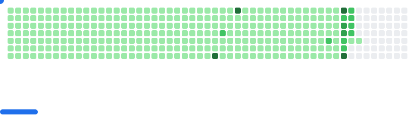

<h3 align="center">Crafting Digital Experiences 🚀</h3>

  🌱 Exploring the ever-evolving world of cloud technologies ☁️ 
  👯 Open to new creative collaborations and exciting projects 
  🯠2025 Mission: Ignite more stars in the Open Source galaxy 
  ⚡ Fun fact: I thrive in the adrenaline rush of online coding contests 
  💬 Got questions? Let's chat <a href="https://github.com/arnabnandy7/arnabnandy7/issues">here</a> 

<h3 align="center">Today's Weather</h3>

  
Kolkata, India - 31/12/2025

  
  
Sunny (সূর্যোজ্জ্বল)

  🌙 <strong>Moon Phase:</strong> Waxing Gibbous (Rise: 01:48 PM, Set: 02:42 AM)   🌅 <strong>Sunrise:</strong> 06:16 AM | <strong>Sunset:</strong> 05:03 PM   💨 <strong>Wind:</strong> 11.9 kph | 💧 <strong>Humidity:</strong> 60% | 🌡️ <strong>Feels Like:</strong> 18.3 °C  

  
<strong>AQI:</strong> Very Unhealthy <strong>PM2.5:</strong> 211.75 <strong>PM10:</strong> 212.75

  ## ⏰ Hourly Forecast  
  | Time | Condition | Temp (°C) | Feels (°C) | Humidity (%) | Wind (kph) | Rain (%) |
| --- | --- | --- | --- | --- | --- | --- |
| 2025-12-31 14:00 |  Sunny | 25.8 | 24.3 | 18 | 12.6 | 0 |
| 2025-12-31 15:00 |  Sunny | 25.5 | 24.1 | 18 | 12.2 | 0 |
| 2025-12-31 16:00 |  Sunny | 23.7 | 23.2 | 22 | 8.3 | 0 |
| 2025-12-31 17:00 |  Clear  | 21.1 | 21.1 | 24 | 7.6 | 0 |
| 2025-12-31 18:00 |  Clear  | 20.1 | 20.1 | 25 | 6.5 | 0 |
| 2025-12-31 19:00 |  Clear  | 19.3 | 19.3 | 26 | 6.1 | 0 |
| 2025-12-31 20:00 |  Clear  | 18.6 | 18.6 | 27 | 5.0 | 0 |
| 2025-12-31 21:00 |  Clear  | 18.0 | 18.0 | 28 | 5.8 | 0 |
| 2025-12-31 22:00 |  Clear  | 17.3 | 17.3 | 29 | 5.8 | 0 |
| 2025-12-31 23:00 |  Clear  | 16.8 | 16.8 | 30 | 5.4 | 0 |

  ## ⛓️ Cryptocurrency Prices  
  🪙 USDC: ₹86.02 | 📈 H: ₹86.02 | 📉 L: ₹86.02  💵 USDT: ₹90.46 | 📈 H: ₹91.0 | 📉 L: ₹90.46  ♦ ETH: ₹266963.0 | 📈 H: ₹271721.0 | 📉 L: ₹265577.9  ₿ BTC: ₹8025025.0 | 📈 H: ₹8070000.0 | 📉 L: ₹7875717.0  ⚡ BNB: ₹78100.49 | 📈 H: ₹78100.49 | 📉 L: ₹76901.64   

  ## 🔋 Fuel Prices  
  ⛽ Petrol: ₹— ➖ 🛢️ Diesel: ₹— ➖

<h3 align="center">😒 Tired of Saying No to someone?</h3>
<h5 align="center">Well, it's time to take a break from the same old "no's" and try something a little more... interesting! ✨</h5>

  I'm channeling my inner grumpy old person and staying home. 🛑❌

<h3 align="center">Let's Connect 🌐</h3>

  
  
  
  
  
  
  
  
  
  
  
  
  

<h2 id="guestbook-📖✒️">GuestBook  📖✒️</h2>

<h3 align="center">Languages and Tools 🛠️</h3>

  
  
  
  
  
  
  
  
  
  
  
   
  
  
  
  
  
  
  
  
  
  
  
  
  
  

<picture>
  <source
    media="(prefers-color-scheme: dark)"
    srcset="images/breakout-dark.svg"
  />
  <source
    media="(prefers-color-scheme: light)"
    srcset="images/breakout-light.svg"
  />
  
</picture>

  

  

  
  
  
  
  <!--  -->
  

  

<h2 align="left" id="## 🏅 Badge Wall">🏅 Badge Wall</h2>

> 🔽 **Tip:** Select the dropdown below to view my full collection of Credly badges.

  
📜 Click here to expand and view my badges

   

  

  <!--START_SECTION:badges-->
  
  
  
  
  
  
  
  
  
  
  
  
  <!--END_SECTION:badges-->
  

## GitAds Sponsored

